# LinRasterizer
#### 1、简介
一个基于ESC架构的的软光栅渲染器实现，通过JobSystem并行加速，支持raycast、rasterization、MSAA等功能

#### 2、编译
###### Mac
窗口系统基于X11,Mac需要安装xquartz
```sh
brew install --cask xquartz
open -a XQuartz
brew install assimp
git clone https://github.com/ljunping/LinRasterizer.git
cd LinRasterizer
mkdir build
cd build
cmake ..
make
```
###### ubuntu
```sh
sudo apt update
sudo apt install xorg
sudo apt install libassimp-dev
git clone https://github.com/ljunping/LinRasterizer.git
cd LinRasterizer
mkdir build
cd build
cmake ..
make
```

#### 3、功能介绍
###### 1、自定义实现数学库
实现了"L_math.h"的数学库，支持向量和矩阵基本运算，支持trs矩阵分解和求逆,实现了常用的look_at、project、rotate、translate矩阵计算方法
###### 2、扫描线光栅化
实现了Sutherland_Hodgman视椎体裁剪算法，基于Bresenham画线算法实现多边形光栅化

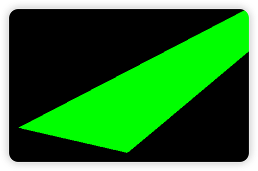

###### 3、光线投射
通过BVH和优先队列加速RayCast(光线投射)
###### 4、纹理加载
基于"stb_image.h"开源库，读取图片数据。实现magnify、minify、mipmap等纹理基本功能

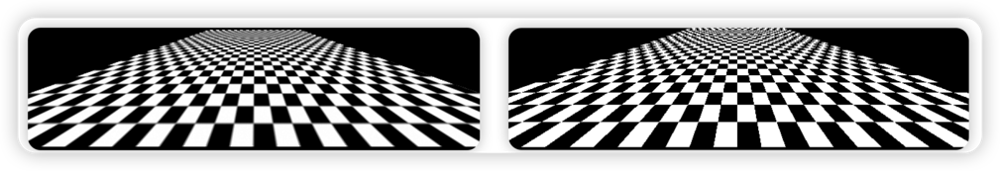

###### 5、.obj模型加载
基于Assimp库加载obj模型，转换为自定义mesh。下图加载了"resources/pig/16433_Pig.obj"文件
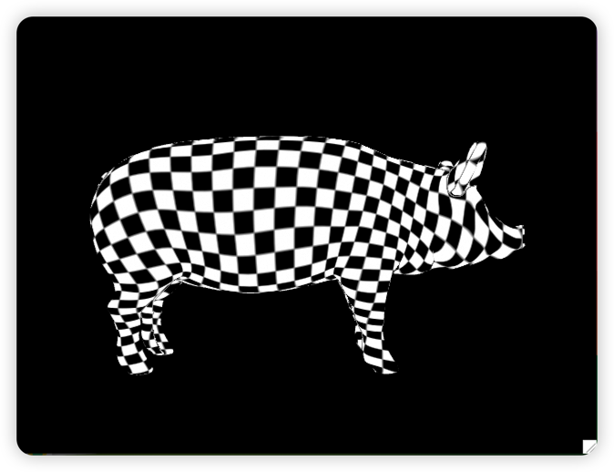

###### 6、MSAA抗锯齿

实现了MSAA抗锯齿，开启4倍MSAA前后的对比,通过MSAA实现边缘提取

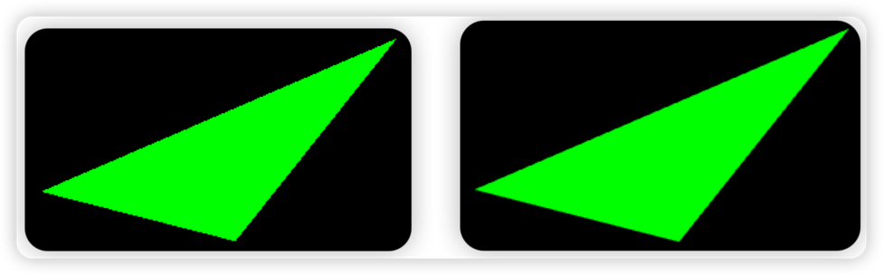

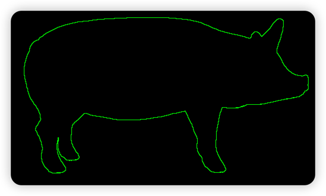

###### 7、JobSystem并行
实现了任务并行化、任务调取、任务窃取机制。具体性能数据列于性能测试
###### 8、透明渲染支持

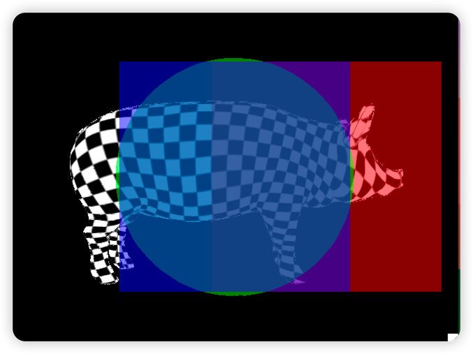

###### 9、ECS架构
类似UNITY引擎，具备GetComponent<T>()、RemoveComponent<T>等基本方法。实现了Transform、Camera、MeshRender等核心组件。
下面多meshRender的效果

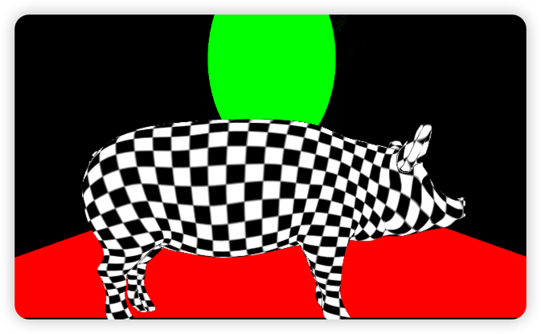

###### 10、phong光照模型、凹凸贴图支持

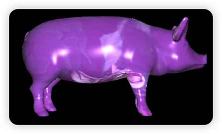


###### 11、阴影shadow_map支持

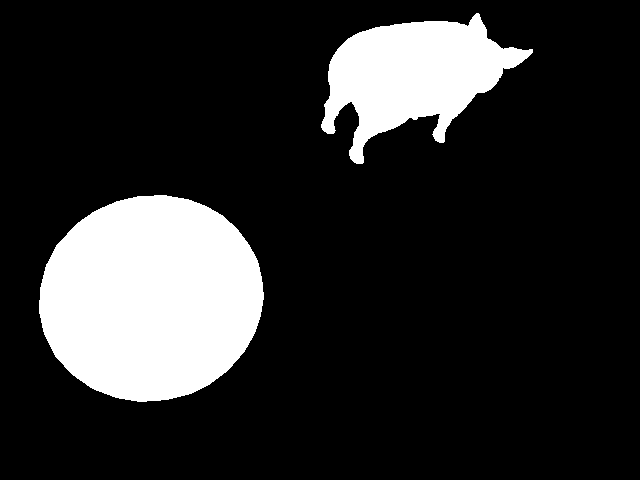
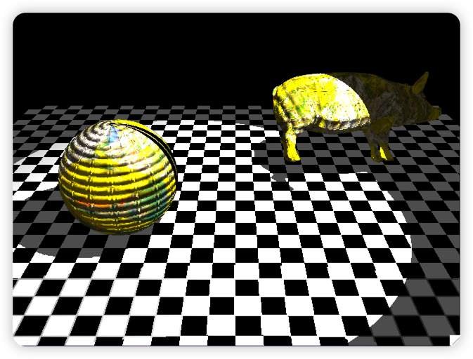


###### 12、全局光照路径追踪实现

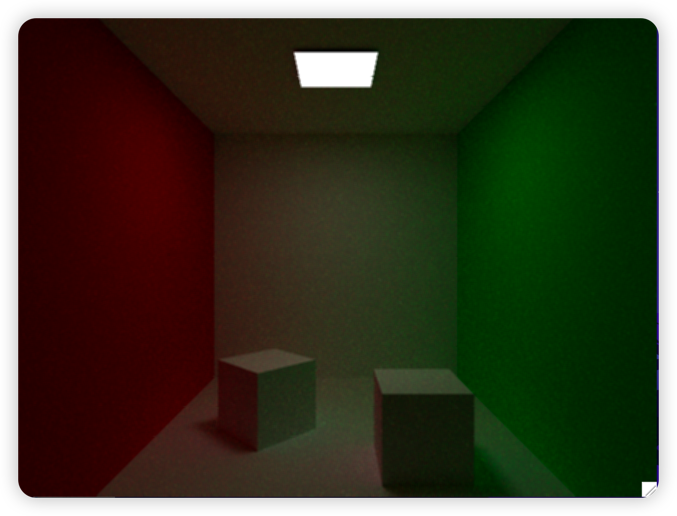
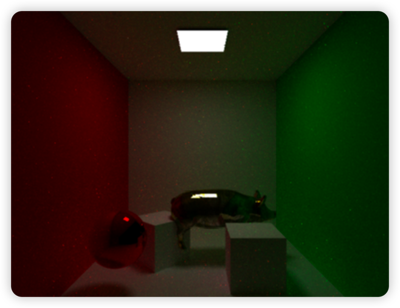


